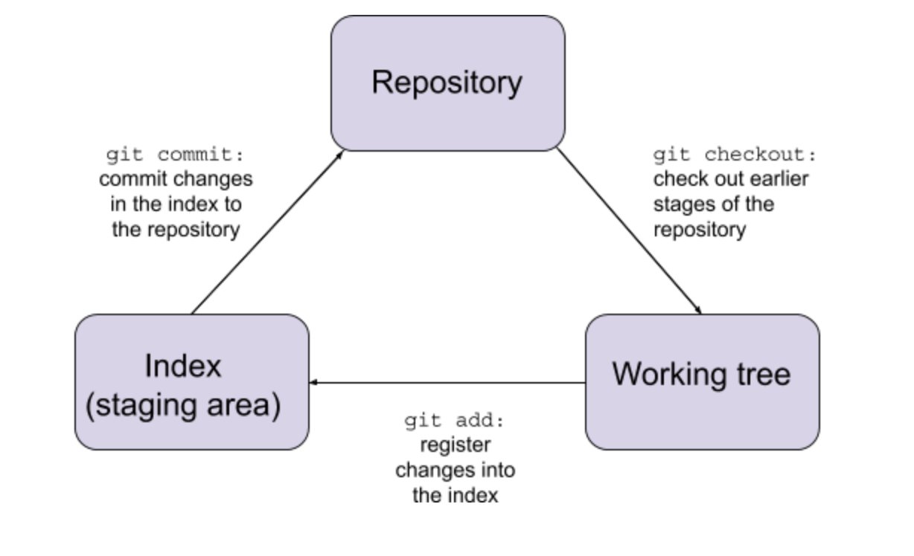

## Git Internals: A Typical Project’s Life-cycle
### Overview
If you have worked on a collaborative project using Git before, you must be familiar with a typical Git project’s life-cycle and commands such as `git clone`, `git add`, `git commit`, and `git push`. We know what the commands do: `git clone` clones the repository into your local machine, and `git commit -m “HELP [Your Partner Name]” `summons your partner who will magically do all the debugging for you… But what is actually going on in the background when you type in these commands?

### The Three Main Areas of Git
- **repository:** a set of commits, each commit is a snap-shot of the working tree at a past date.
- **the index** (or the staging area): changes to your file are first put into the index before committed into the repository.
- **working tree:** any directory on your local machine associated with a repository. This is where you interact with your project.

  Some other useful terms:
- **branch** (also called a reference): a reference to a commit. New commits are added into the current branch, resulting in a fork in the history of the project.
- **HEAD:** defines what is currently checked out. If you are checking out a branch, HEAD will point to this branch.

Below is a diagram of a typical Git project’s life-cycle using these terms (with Git commands):



### The Three Main Git Objects

The Git “Blob-System”:

In many ways the way that Git stores and maintains a repository is similar to the way files are stored in the UNIX filesystem.  Specifically, the importance of the inode -- a unique identifier stored in the metadata of the filesystem -- is mirrored by git “blobs”.  Blobs are hashes of the file’s size and contents, and when used as the identifier for files, you can guarantee that the files contents and size will not change when you hold the blob constant.  In essence, this renders each commit of the repository immutable, which is one of the fundamental aspects of Git that makes many things possible.


- **Blobs:**
Git represents your file contents with blobs.
A blob is the SHA1 id of its size and contents. The same contents will always have the same blobs, unlike an inode-number of a file which remains unchanged if we make some edits to the file.
When using blobs as the identifier for files, you can guarantee that the files contents and size will not change when you hold the blob constant.  In essence, this renders each commit of the repository immutable, which is one of the fundamental aspects of Git that makes many things possible.
With blobs, it becomes clear to see how the working-tree of the repository is maintained (“tree” should be the operative term here).  Blobs are used as leaves in the working-tree, and can only be changed through commits.  In fact, technically blobs are never changed, because each commit object in the repository contains its own immutable, unique copy of the working-tree.

- **Trees:**
If blobs correspond to the inode number or file contents in the UNIX file system then trees correspond to the directory. A tree contains some entries - these entries can either be blobs, or subtrees.

- **Commits:**
Recall that commits are snap-shots of the working tree at a certain time. A commit object includes these following information: the tree for the snap-shot at a certain point, the commits that directly precede this one, information about the author, and the commit message.

Now let’s explore what happens when we get a Git repository.
***

## Getting a Git repository: git init and git clone

There are two ways to get a Git repository - we can either (1) turn a local directory into a Git repository, or (2) clone an existing Git repository from elsewhere.

**1. Turn a local directory into a Git repository**

```
$mkdir testdir
$cd testdir
```

We are now in our newly-created directory named testdir on our local machine. If we type ls -la, we can see that the only entries in testdir are “.” and “..”. The next step is to type:

```
$git init
```

This will create a new entry called .git in testdir:

```
drwxr-xr-x   9 Git-username  staff   288 May 21 17:11 .git
```

We can type `ls -la .git` to see what is inside this .git directory:

```
total 24
drwxr-xr-x   9 Git-username  staff  288 May 21 17:11 .
drwxr-xr-x   3 Git-username  staff   96 May 21 17:11 ..
-rw-r--r--   1 Git-username  staff   23 May 21 17:11 HEAD
-rw-r--r--   1 Git-username  staff  137 May 21 17:11 config
-rw-r--r--   1 Git-username staff   73 May 21 17:11 description
drwxr-xr-x  13 Git-username  staff  416 May 21 17:11 hooks
drwxr-xr-x   3 Git-username staff   96 May 21 17:11 info
drwxr-xr-x   4 Git-username  staff  128 May 21 17:11 objects
drwxr-xr-x   4 Git-username  staff  128 May 21 17:11 refs
```

The `HEAD` file points to the current branch, and the `index` file (not yet created, since we haven't added anything to the staging area) stores the staging area information. The `objects` file contains our database. Since `testdir` is empty,

```
$find .git/objects -type f
```

does not give us anything.


**2. Clone an existing repository from elsewhere**

```$git clone https://github.com/trangqngo/Git-Internals.git
```

This creates a directory called `Git-Internal`s and initializes a `.git` subdirectory in `Git-Internals. `
`Git-Internals` will be in the directory that you are in when you type `git clone`, but you can also specify the target directory `my-directory` with:

```
$git clone <url> my-directory
```

`Git-Internals`, unlike `testdir` which we made from scratch, is not empty. It has one file named README.md:

```
ls
README.md
```

Now, if we type

```
$find .git/objects -type f
```

we will see that `.git/objects` have three files:

```
.git/objects/d9/c1a856e19882438b1df7229a2bf2723cc49515
.git/objects/20/34f7b82db9a10d38a4bd8998e1a8c91641a09d
.git/objects/5e/22a116450b62d8016de196d3d576e9d9fe46f3
```

This is how Git stores our content: each piece of content is in a single file. The ubdirectory is named with the 2 characters of the SHA-1 (e.g. `d9` from the first file above), the file is named with the remaining characters.

We can see which type each of these objects are by typing

```
git cat-file -t d9c1a856e19882438b1df7229a2bf2723cc49515
blob
git cat-file -t 5e22a116450b62d8016de196d3d576e9d9fe46f3
commit
git cat-file -t d9c1a856e19882438b1df7229a2bf2723cc49515`
tree
```

***
## git add and commit

The normal life cycle of a git repository consists of a sequence of edits, commits, branches, merges, resets, and many more, but adding changes and committing them will always be the building-block for any programmer using git.  Before getting into those operations, however, we must talk about “the stage” or the “index”.  These names signify the middle-ground between the local maintainer, and his/her edits, and the repository stored somewhere out there in the cloud.  In a way, it functions similarly to a “write-buffer” is filesystems, because running

```
$ git add <filename1>
```

does change any shared content, but rather stores the blob for <filename1> in the repositories “index” file.  It is only when you run

```
$ git commit -m “message”
```

while having a file reference in your repository’s index file, that these changes are reflected in the shared repository.
***
## git merge

Recall that the git repository is comprised of commits, each with their own version of the working-tree.  Within the repository, there is always a HEAD, that signifies the most recent commit, or the commit that should be used during cloning operations.  However, there are situations when repository contributors want to create a “branch” that diverges from the current commit ancestry.  The repository cannot exist like that forever, though, and that’s where merging comes in.  Merging takes the two branches of a repository (their most recent commit and working-tree) and creates a new commit such that the changes in one branch and reflected in the other, thus connecting the two branches into one.  From here arises the possibility for the pesky “merge conflict”, where changes to the same file in the repository make for no clear, unambiguous resolution between the two branches.  The way that git resolves these merge conflicts is beyond the scope of this project, however one should always be careful about what you modify and what your fellow maintainers modify in the repository to avoid them.

***
## Rebase
Rebasing is a similar operation that internally does something very different.  After rebasing, there is only one branch, as in merging.  In contrast to merging, however, rebasing takes each base commit of a branch, in increasing order of distance to the diverging point of the repository, and successively commits each one to the head of the other branch.  The end result is similar, as the changes created in the branch are reflected in the other branch, but instead of doing this with just the endpoints of both branches, git does this iteratively.

Note, however, that best practices for rebasing only apply to local repositories.  For each commit in the branch, rebase makes an additional commit to the head of the master branch.  This, in essence, changes each commit in the rebasing branch, because initially each commit indicated a hierarchical transformation from the fork of the branch to the head of the branch.  Now, each commit must transform the head of the master branch to the successive commits on the rebasing branch.
***
### References
- This chapter on [Git Internals](https://git-scm.com/book/en/v2/Git-Internals-Plumbing-and-Porcelain) from the [Pro Git](https://git-scm.com/book/en/v2) book by Scott Chacon and Ben Straub
- [Git from the Bottom Up](https://jwiegley.github.io/git-from-the-bottom-up/) by John Wiegley
-   This blog post on [Visual Git Reference](https://marklodato.github.io/visual-git-guide/index-en.html) by Mark Lodato
